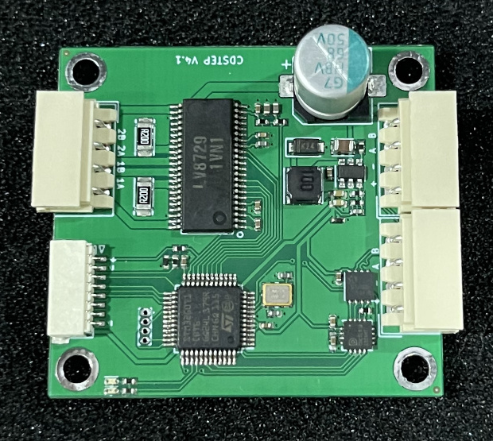
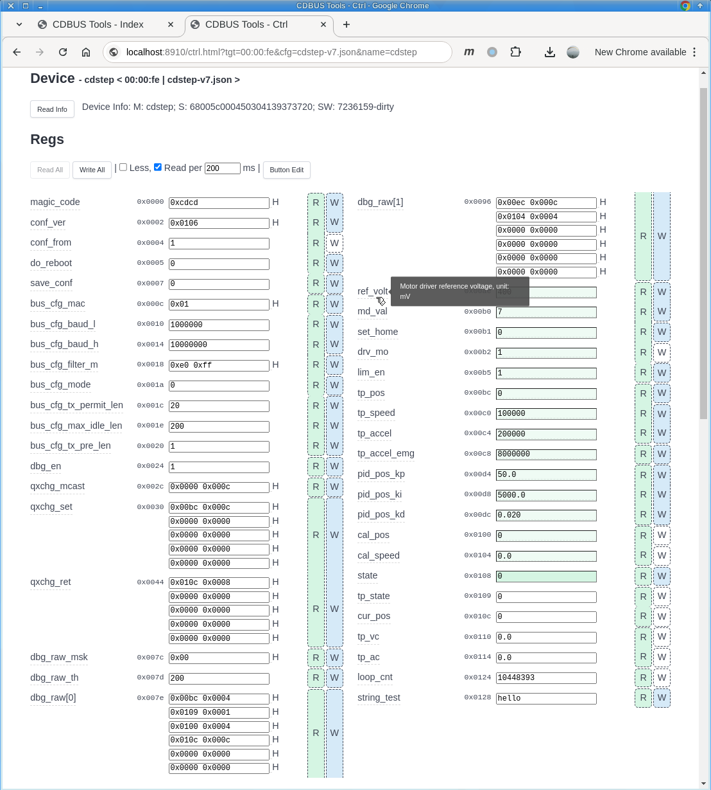
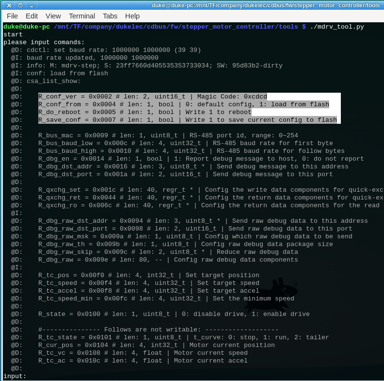
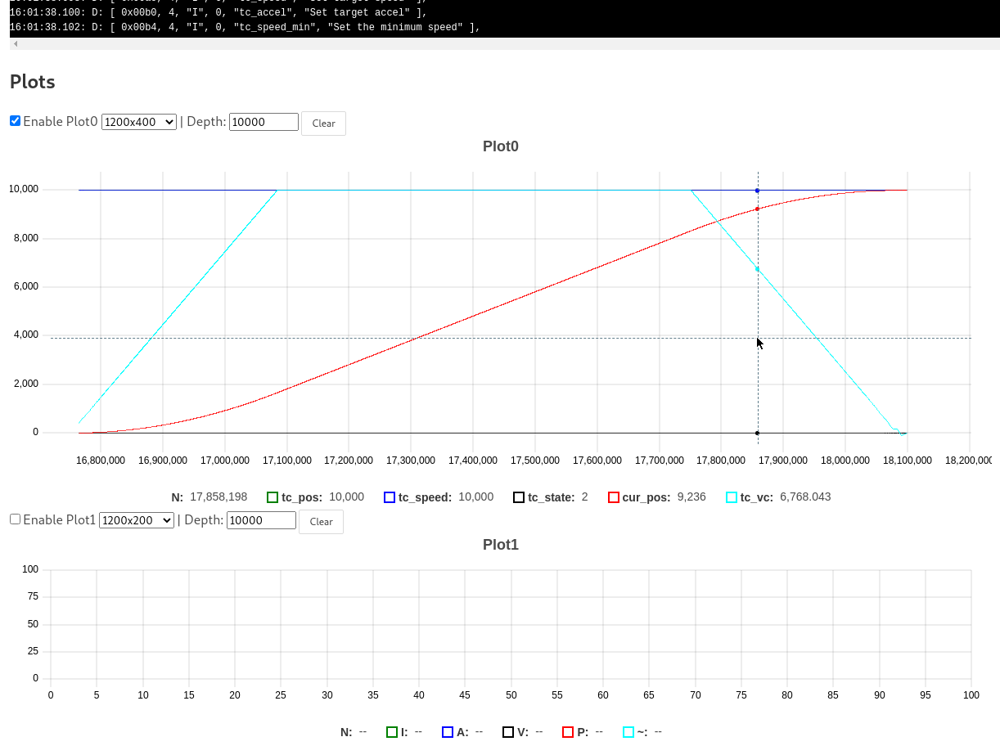
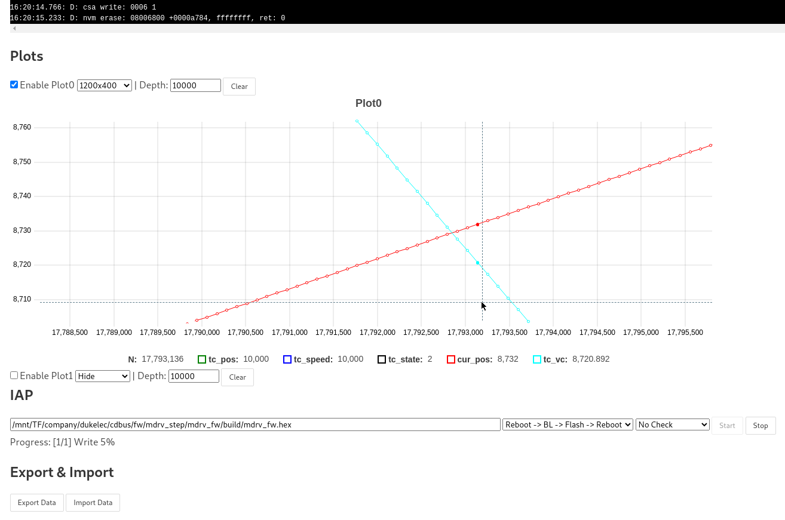

CDSTEP Introduction
=======================================

中文說明 (Chinese): [./Readme_zh.md](./Readme_zh.md)



RS-485 wire housing: Molex 5264 (4 pin)

Download this project:
```
git clone --recurse-submodules https://github.com/dukelec/cdstep.git
```

## GUI Tool

CDBUS GUI Tool: https://github.com/dukelec/cdbus_gui

After power on, first write 1 to `state`, then write the target position to `tc_pos`, then the stepper motor will rotate.




After modifying the configuration, write 1 to `save_conf` to save the configuration to flash.  
If you need to restore the default configuration, change `magic_code` to another value and save it to flash. Then reapply power.

Logs:



Plots:



Plot details, IAP upgrade, data import/export (including registers, logs, plots).




## Protocol

CDSTEP is an open source stepper motor controller, it uses RS485 interface, the default baud rate is 115200 bps, the highest > 10 Mbps, the default address is 0xfe.

The underlying protocol is CDBUS, and its frame format is  
`src, dst, len, [payload], crc_l, crc_h`

It contains 3 bytes of header, data and last 2 bytes of CRC (same as ModBus CRC).  
For details of CDBUS protocol, please refer to: https://cdbus.org

The Payload part is the CDNET protocol and supports both CDNET L0 and L1 versions.  
For details of CDNET protocol, please refer to: https://github.com/dukelec/cdnet


CDNET mainly refers to the concept of UDP in TCP/IP.  
For example, in the simplest CDNET L0 protocol, the format of sending a byte of data 0x00 from the default port of the host to port 1 of CDSTEP:

`01 00`

The first byte is the target port number, followed by the data.

In the above example, the complete CDBUS protocol frame is (default host address is 0, CDSTEP is 0xfe):

```
00 fe 02  01 00  crc_l crc_h
```

In the above example, port 1 is related to device information. The port number can be regarded as the main command number.
The first byte of data is agreed to be the sub-command number, and the sub-command number 0x00 is to read the device information.

CDSTEP has 4 ports to receive commands, which are:

### Port 1: Device information

The only subcommand number 0 is used to query information.

Return 0x80 + device information string, such as `M: cdstep; S: 23ff7660d405535353733034; SW: v1.1`.

### Port 5: Parameter table read and write

The parameter table in the code is a global structure of type `csa_t`, csa is the abbreviation of Config Status Area, and the first half of it can be written into Flash to save some user settings.
Restore the first half of the data of the csa from the flash at power-on.
The latter part of the data is some variables in operation.
These variables are exposed to the user through this interface, allowing the user to directly read and write, which can greatly simplify the code.

However, before and after reading and writing, we can perform security checks on the written data through predefined hook functions, or define actions that need to be performed after writing.
For the read command, the data format that the user needs can be prepared in advance, such as format conversion.

In addition, in order to facilitate the user's overall synchronization of csa information, we have defined which areas of the csa can be written. Users don't need to avoid the unwritable area carefully, the written data will be ignored directly.

For example, we can directly put a pid object in the csa table. The pid object has some internal variables, which should not be modified by the user.
With the definition of writable area, users can write data in a whole block very conveniently, without worrying about writing data that should not be written.

The subcommands for reading and writing the parameter table are:

```
read:       0x00, offset_16, len_8   | return [0x80, data]
read_dft:   0x01, offset_16, len_8   | return [0x80, data]
write:      0x20, offset_16 + [data] | return [0x80] on success
```

For example, set the motor to be powered on and locked. The value of motor state `state` is: 0 power-down, 1 power-on lock.

The address of the `state` itself is `0x00b8`, the length is 1 byte, then when it needs to be locked, send the following data to port 5:
```
20  b8 00  01
```
`20` is the subcommand `write`, `b8 00` is the little-endian format of the address 0x00b8 (unless otherwise specified, all use little-endian), and the last `01` is the write value.

Modifying the definition of `csa_t` may affect the address of many registers. If we calculate the address of each register manually each time, it is very troublesome and easy to make mistakes, so we use the function `csa_list_show` to automatically print out the address, type, and description information of all registers when power on, which can be directly copied to the configuration file.

Every time you modify the definition of `csa_t`, please also modify the version number of `conf_ver` in it.


### Port 6: Data Quick Exchange

Commonly used parameter table items for position mode are:
```
tc_pos, type: int32_t
tc_speed, type: uint32_t
tc_accel, type: uint32_t
```

We can write these data through port 5, but sometimes we also want to write other non-continuous entries. This will split multiple commands, which is inefficient and easily leads to data out of sync.  
Moreover, we also want the device to reply to the error code of the motor and some operating data at the same time, but the operating data we care about in different modes are not the same, and it will be more inconvenient if it is fixed.

There is the configuration of the Data Quick Exchange channel in the parameter table:

```
regr_t          qxchg_set[5];
regr_t          qxchg_ret[5];
```
In the above array, the first element with a size value of 0 means it and the subsequent ones are not used. Definition of elements:
```
typedef struct {
    uint16_t        offset;
    uint16_t        size;
} regr_t; // reg range
```

`qxchg_set` and `qxchg_ret` are used by the Data Quick Exchange subcommand `20`,
Set up which data to write and which data to return in advance, and then send `20` + data to be written.
Will return `80` + the returned data.

`qxchg_set` default only uses one element, pointing to the area where the three entries of `tc_pos`, `tc_speed` and `tc_accel` are located.  
If you need to modify the target position parameter `tc_pos` to 0, just write the data `20  00 00 00 00` to port 6 (`20` is the subcommand number).  
If you need to modify the target position and target speed at the same time, for example, the position is 0x00001000, and the speed is 0x00000500, then write `20  00 10 00 00  00 05 00 00`.

The subcommand `2f` supports receiving broadcast or multicast packets containing data for multiple devices.


### Port 8: Flash read and write

IAP upgrade can be achieved through this interface.

The subcommands are:

```
erase:   0x2f, addr_32, len_32  | return [0x80] on success
write:   0x20, addr_32 + [data] | return [0x80] on success
read:    0x00, addr_32, len_8   | return [0x80, data]
cal crc: 0x10, addr_32, len_32  | return [0x80, crc_16] # modbus crc
```

First, erase the area to be written, then write the data, and finally call crc to calculate whether the written data is correct.
You can also read back all the data for comparison, the speed will be a little slower.

After the Bootloader is powered on, first use the default baud rate of 115200. If you receive a command from the host to set `keep_in_bl`, the baud rate will be maintained. If the command is not received within one second, it will switch to the baud rate saved in Flash. Rate continues to wait for commands.
If the command is still not received after another second, the APP firmware will be executed.
Bootloader and APP share the beginning of the csa configuration, which contains the baud rate set by the user.

If you don't know the current ID number of CDSTEP, you can send an info command to the broadcast address 0xff to search for it.

The current MCU Flash is 128K in total, each page size is 2K, the first 24K stores the Bootloader, the last 2K stores the csa parameter table, and the rest are APP.


## Plot protocol

Just like the `qxchg_XXX` array of the Quick Exchange channel, the plot uses the same method to define the data to be reported, and you can freely configure the variables you want to observe.
Different from `qxchg_XXX`, a data packet will store a lot of data, and it will be sent to the host after the data packet is full to a certain extent.

If it is a fixed period, such as FOC motor, you can add 1 to a variable (such as `loop_cnt`) in the current loop, and then just write `loop_cnt` at the top of each data packet.  
But for the stepper motor control, the period is not fixed, so the time information and other observed variables should be recorded together every time.

When debugging with plot, it is recommended to set the baud rate of the device higher.  
If the amount of data is large, CDSTEP will store continuous information in the buffer. After the buffer is full, it will wait for the buffer to be completely emptied before continuing, which can ensure the continuity of the data to the greatest extent and avoid loss of details.

