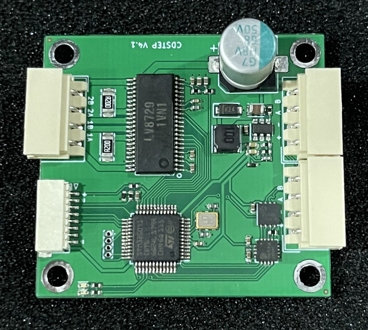
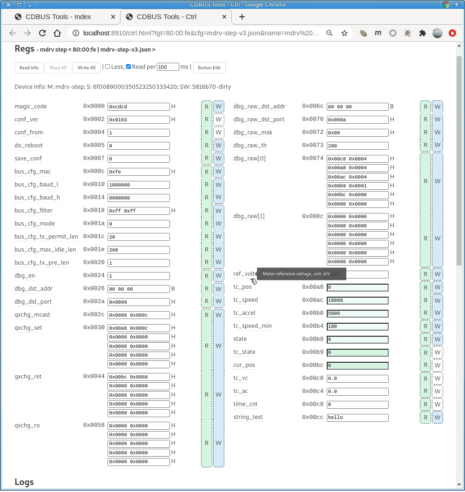
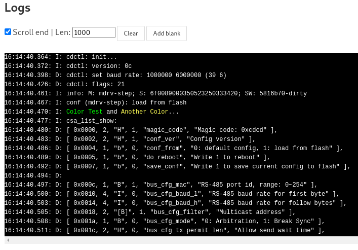

CD-MDRV-STEP 簡介
=======================================



RS-485 插頭型號: Molex 5264 (4 pin)

下載項目：
```
git clone --recurse-submodules https://github.com/dukelec/stepper_motor_controller.git
```

## 圖形配置工具

CDBUS GUI Tool: https://github.com/dukelec/cdbus_gui

上電後，先往 `state` 寫 1，然後往 `tc_pos` 寫入目標位置 ，步進電機便會轉動。



修改配置後，往 `save_conf` 寫 1 保存配置到 flash。  
如果需要恢復默認配置，修改 `magic_code` 爲其它值，保存到 flash，然後重新上電即可。

調試打印窗口：



波形窗口：


波形細節、IAP 升級、數據導入導出（包含寄存器、log、波形）：


## 協議

MDRV-STEP 是一個開源步進電機控制器，它使用 RS485 接口，默認波特率爲 115200 bps, 最高 > 10 Mbps，默認地址爲 0xfe.

最底層協議爲 CDBUS，其幀格式爲：  
`src, dst, len, [payload], crc_l, crc_h`

由 3 字節頭、數據 和 最後 2 字節的 CRC 結尾（算法同 ModBus RTU 的 CRC）。  
CDBUS 協議具體參見： https://github.com/dukelec/cdbus_ip

Payload 部分爲 CDNET 協議，同時支持 CDNET L0 和 L1 兩個版本。  
CDNET 協議具體參見： https://github.com/dukelec/cdnet


CDNET 和 TCP/IP 中的 UDP 的概念比較類似，主要參考 UDP 的端口號的概念。  
譬如最簡單的 CDNET L0 協議，從主機默認端口發送一個字節數據 0x00 到 MDRV 的 1 號端口的格式：

`01 00`

第一個字節是目標端口號，然後跟數據即可。

以上示範，完整的 CDBUS 協議幀爲（主機地址默認爲 0，MDRV 爲 0xfe）：

```
00 fe 02  01 00  crc_l crc_h
```

以上示範，端口 1 是設備信息相關的，端口號可以看做 主命令號，首字節數據約定爲 子命令號，
子命令號 0x00 是讀設備信息。

MDRV 一共有 4 個端口接收指令，分別是：

### 端口 1: 設備信息

唯一一個子命令號 0 是用來查詢信息。

返回 0x80 + 設備信息字符串，譬如 `M: mdrv-step; S: 23ff7660d405535353733034; SW: v1.1`.

### 端口 5: 參數表讀寫

參數表在代碼中是 `csa_t` 類型的全局結構體，csa 爲 Config Status Area 的縮寫，它的前半部分可以寫入 Flash 中，以保存一些用戶設置，
上電時從 flash 中恢復 csa 的前半部分數據。而後部分數據爲運行中的一些變量，通過此接口把這些變量暴露給用戶，讓用戶直接讀寫可以大大簡化代碼。

不過，我們在讀寫前後，可以通過預先定義的 hook 鉤子函數，對寫入數據進行安全檢查，或是定義寫入後需要執行的動作。
而對於讀取命令，可以提前爲用戶準備其所需要的數據格式，譬如格式轉換。

另外，爲了方便用戶整體同步 csa 信息，我們定義了 csa 的哪些區域可寫，不可寫的區域用戶不用小心避開，寫入的數據直接會被忽略。

譬如，我們可以直接把 pid 對象放在 csa 表中，pid 對象中有一些是內部變量，不應該被用戶修改，
有了可寫區域限制，用戶可以非常方便的整塊寫入數據，不用擔心寫到不該寫的數據。

讀寫參數表的子命令爲：

```
read:       0x00, offset_16, len_8   | return [0x80, data]
read_dft:   0x01, offset_16, len_8   | return [0x80, data]
write:      0x20, offset_16 + [data] | return [0x80] on success
```

譬如設置電機鎖舵並進入位置模式。電機狀態 `state` 值爲 0 不鎖舵，爲 1 鎖舵。

`state` 本身的地址是 `0x00b8`，長度 1 個字節，那麼上電後需要鎖舵，發送以下數據到端口 5 即可：
```
20  b8 00  01
```
`20` 是子命令 `write`，`b8 00` 是地址 0x00b8 的小端格式（除非特別說明，否則都是用小端），最後一個 `01` 是寫入數值。

修改 `csa_t` 的定義，可能會影響到很多寄存器的地址，如果每次都是手工計算各寄存器的地址，很麻煩且容易出錯，所以，我們通過 `csa_list_show` 這個函數，
上電時自動打印出所有寄存器的地址、類型，以及說明信息，可以直接拷貝到配置文檔中。

每次修改 `csa_t` 的定義後，請同時修改其中的 `conf_ver` 版本號。


### 端口 6: 快速讀寫

位置模式常用的參數表項有：
```
tc_pos, type: int32_t
tc_speed, type: uint32_t
tc_accel, type: uint32_t
```

我們可以通過端口 5 來寫這些數據，但是，有的時候我們還想去寫非連續的其它 表項，這樣就要拆分多條命令，效率低，且容易導致數據不同步。  
而且，我們還想設備同時回覆電機的錯誤碼和一些運行數據，但不同模式下我們關心的運行數據不盡相同，如果寫死會比較不方便。

參數表項內有 快速讀寫 通道的配置：（qxchg 是 quick exchange 的縮寫）

```
regr_t          qxchg_set[5];
regr_t          qxchg_ret[5];
```
以上數組，首個 size 值爲 0 的元素表示它和後序的未使用，元素的定義：
```
typedef struct {
    uint16_t        offset;
    uint16_t        size;
} regr_t; // reg range
```

`qxchg_set` 和 `qxchg_ret` 是 快速讀寫 的 子命令 `20` 所用，
預先設置好寫哪些數據，以及返回哪些數據，然後發送 `20` + 需要寫的數據就可以了，
會返回 `80` + 返回的數據。

`qxchg_set` 默認設定只用了一個元素，指向 `tc_pos`, `tc_speed` 和 `tc_accel` 這 3 個表項所在的區域，  
如果需要修改目標位置參數 `tc_pos` 爲 0，向 端口 6 寫數據 `20  00 00 00 00` 即可（`20` 是子命令號）。  
如果需要同時修改目標位置和目標速度，譬如位置改爲 0x00001000，速度改爲 0x00000500，則寫入 `20  00 10 00 00  00 05 00 00`.

子命令 `2f` 支持接收包含多個設備數據的廣播或組播包。


### 端口 8: Flash 讀寫

可以通過此接口實現 IAP 升級。

子命令爲：

```
erase:   0x2f, addr_32, len_32  | return [0x80] on success
write:   0x20, addr_32 + [data] | return [0x80] on success
read:    0x00, addr_32, len_8   | return [0x80, data]
cal crc: 0x10, addr_32, len_32  | return [0x80, crc_16] # modbus crc
```

先要把需要寫的區域擦除，然後寫入數據，最後調用 crc 計算所寫數據是否正確即可。
也可以讀回所有數據來判斷，速度會稍慢一點。

Bootloader 上電後，先使用默認波特率 115200，如果收到主機設置 `keep_in_bl` 的命令就保持此波特率，如果一秒鍾內沒有收到該命令，則切換到 Flash 中保存的波特率繼續等待命令，如果再過一秒依然沒收到命令，則跳轉執行 APP 固件。Bootloader 和 APP 共享 csa 配置的開頭部分，其中包含了用戶設置的波特率。

如果不知道 MDRV 當前的 ID 號，可以發送 info 命令到廣播地址 0xff 進行搜尋。

當前 MCU Flash 總共 128K, 每頁大小爲 2K, 前 24K 存放 Bootloader，最後 2K 存放 csa 參數表，其餘爲 APP.


## 波形數據

和 快速讀寫 通道的 `qxchg_XXX` 數組一樣，波形數據用同樣的方式定義需要上報的數據的組成，可以自由配置想要觀察的變量。
和 `qxchg_XXX` 不同的是，一個數據包會存放很多組數據，等數據包滿到一定程度再發送給主機。

如果是固定週期的情況，譬如 FOC 電機，可以在電流環中爲一個變量（譬如 `loop_cnt`）每次加 1，然後只需要把 `loop_cnt` 寫在每個數據包的最前面即可。  
但我們這個 stepper motor 控制，週期不固定，所以要把時間信息和其它被觀察的變量，每次都一起記錄。

使用 plot 調試時，建議把設備的波特率設置高一些。  
如果數據量很大，MDRV 會把連續的信息保存在 buffer 中，buffer 滿之後，會等待 buffer 完全清空再繼續，能最大程度保證數據的連續性，避免細節丟失。

